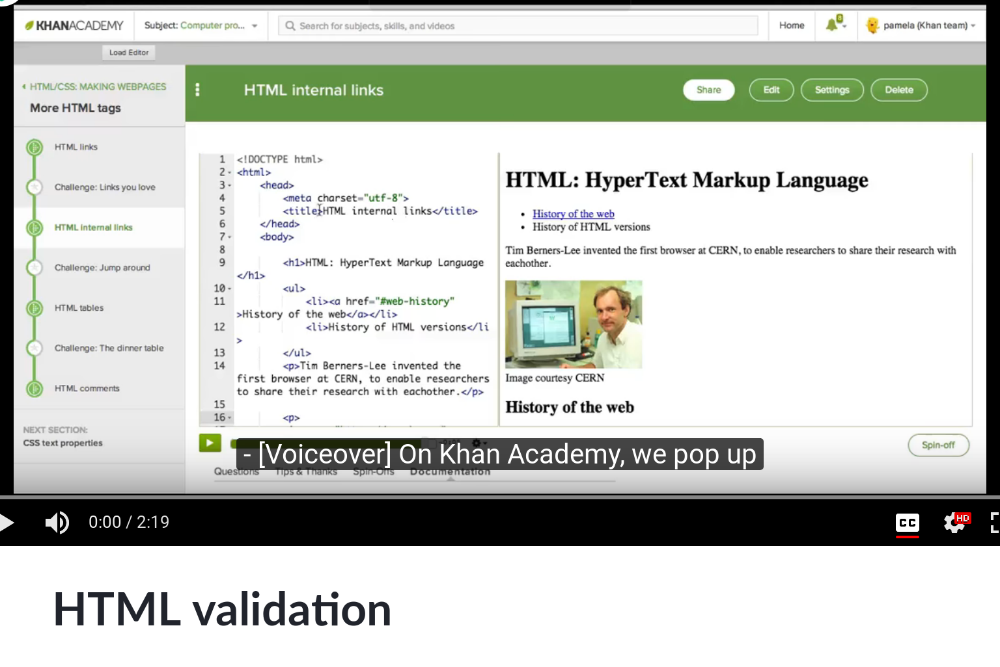
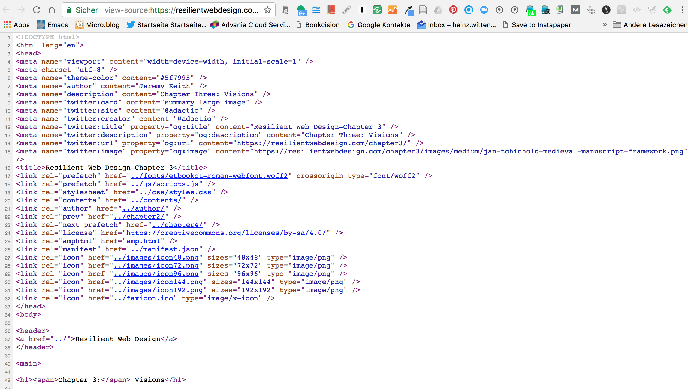
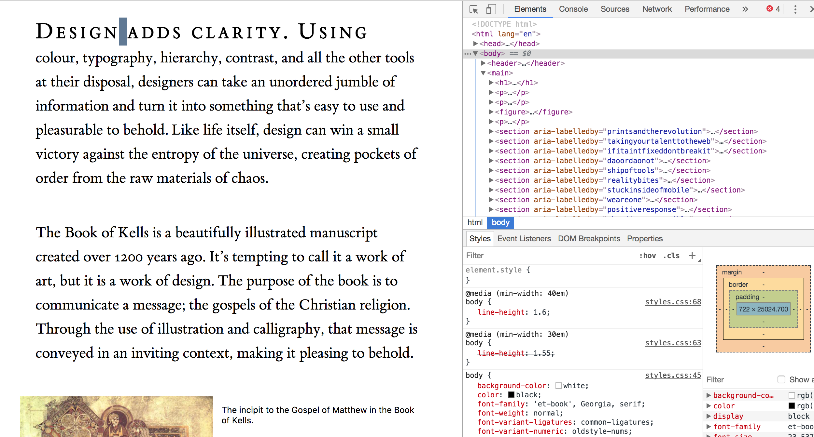
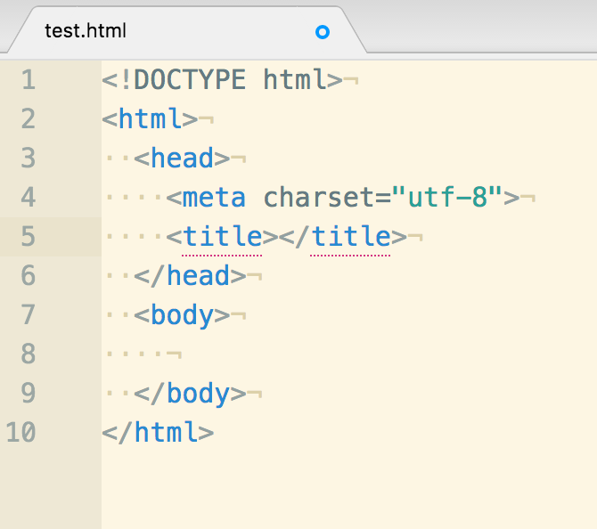
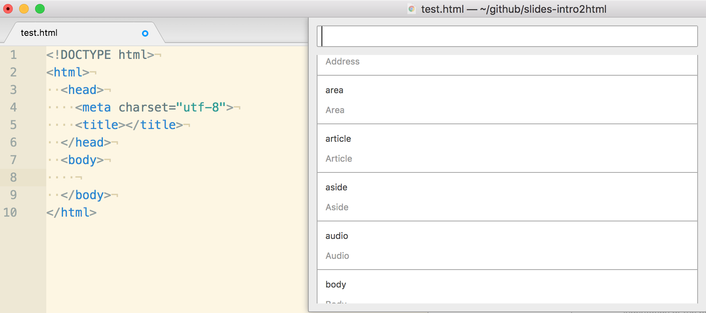
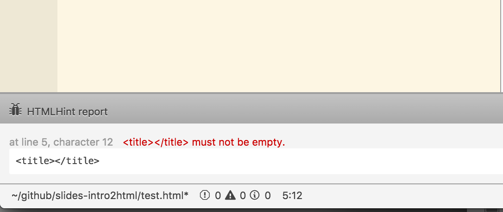
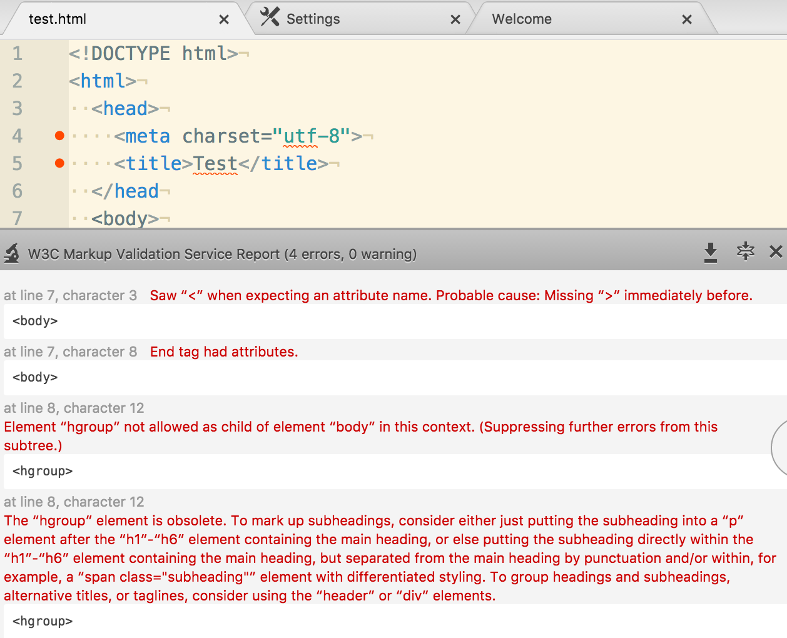

# Session 2020-12-11

## Targets

- Understanding of HTML basics
- Knowing how to publish a simple static website via GitHub
- Understanding of task(s)

## Task

<blockquote class="trello-card"><a href="https://trello.com/c/AMDdswMr/119-task-5-development-of-a-small-website-workload-approx-25-hours-approx-10-to-15-hours-html-10-hours-css">Task 5: Development of a small website (Workload: approx. 25 hours (approx. 10 to 15 hours HTML, 10 hours CSS)</a></blockquote>

- Lecture report: Semantic HTML
- Book review: [Resilient Web Design](https://resilientwebdesign.com/ "Resilient Web Design")

# HTML&mdash;What and Why?

## The Language of the Web

[The Web as Context for HTML](https://heinzwittenbrink.github.io/slides-historyofhypermedia/#/9/4 "A very short history of hypermedia")

---

- Hyperlinks as essential feature
- Easy and robust
- Device independence
- Accessibility
- Sustainability and backwards compatibility


## Characteristics of the Standard

- Living, extensible, *webby*
- Closely related to other standards
- Focused on accessibility and device-neutrality, *degrowth-fit*

## Frontend Components

- HTML: Content
- CSS: Presentation
- JavaScript: Behaviour
- (Media)

## Example: Adactio

- [Adactio: Jeremy Keith](https://adactio.com/ "Adactio: Jeremy Keith")
- HTML: Source: view-source:<https://adactio.com/>
- CSS: view-source:<https://adactio.com/skins/tatemodern/global.css?20200520>
- JavaScript: <https://gist.github.com/adactio/d988edc418aabfa2220456dc548dedc1>

## HTML Rendering

- Visual display on screens
- Aural rendering by screenreaders
- Braille readers

## Rendering Engines

- [Blink (The Chromium Project](https://www.chromium.org/blink "Blink (Rendering Engine) - The Chromium Projects"))
- [WebKit](https://webkit.org/ "WebKit")
- [Gecko - Mozilla | MDN](https://developer.mozilla.org/en-US/docs/Mozilla/Gecko "Gecko - Mozilla | MDN")
- [Servo](https://servo.org/ "Servo")

## HTML beyond the Website

- Feeds: RSS, Atom ([Example](https://wittenbrink.net/tt-rss/ "Tiny Tiny RSS")), JSON
- Email
- Crippled HTML in Silos

## HTML Processing by Non-Humans

- Browser
- Search Engines
- Text Processors

## The Document Object Model

<a title="Taka, CC BY-SA 3.0 &lt;http://creativecommons.org/licenses/by-sa/3.0/&gt;, via Wikimedia Commons" href="https://commons.wikimedia.org/wiki/File:DOM-representation.png"></a>

---

- Standard-API for HTML Processing
- Modelling of the Document as a Tree

## HTML Syntax Basics

- Descriptive markup: elements, attributes, comments
- Features for human consumption
- Features for processing by machines
- HTML as a language for web applications

## Good Practice for Content Authors

- Semantic markup
- Descriptive markup for human users
- Hierarchical modelling


# Design principles

## Content first

- Separation of content and presentation
- Descriptive markup of content
- Additional markup for machines

## Progressive enhancement

- Accessibility and future friendliness
- Universal usability of the content
- Device independence

# Standardization


## W3C


[W3C HTML](https://www.w3.org/html/ "W3C HTML")

## WhatWG

{ width=30% }

- [HTML Standard](https://html.spec.whatwg.org/multipage/ "HTML Standard")
- Repository on GitHub: [whatwg/html: HTML Standard](https://github.com/whatwg/html "whatwg/html: HTML Standard")

## History of the standard: beginnings

- 1992: Tim Berners-Lee: [Tags used in HTML](https://www.w3.org/History/19921103-hypertext/hypertext/WWW/MarkUp/Tags.html "Tags used in HTML")
- 1993: [Hypertext Markup Language (HTML) Internet Draft](https://www.w3.org/MarkUp/draft-ietf-iiir-html-01.txt "https://www.w3.org/MarkUp/draft-ietf-iiir-html-01.txt")
- 1995: [RFC 1866 - The 'text/html' Media Type](https://tools.ietf.org/html/rfc1866 "RFC 1866 - The 'text/html' Media Type")

Source: @2017c

## History of the standard: W3C Recommendations

- January 1997: [HTML 3.2 Reference Specification](https://www.w3.org/TR/REC-html32 "HTML 3.2 Reference Specification")
- December 1997: [HTML 4.0 Specification](https://www.w3.org/TR/REC-html40-971218/ "HTML 4.0 Specification"): strict - frameset - transitional
- 2000/2002: [XHTML 1.0](https://www.w3.org/TR/xhtml1/ "XHTML 1.0: The Extensible HyperText Markup Language (Second Edition)")

Source: @2017c

## History of the standard: WhatWG, W3C

- 2004: Founding of [Web Hypertext Application Technology Working Group](https://whatwg.org/ "Web Hypertext Application Technology Working Group")(WhatWG)
- since 2006: Cooperation of WhatWG and W3C
- 2014: W3C-Specification [HTML5](https://www.w3.org/TR/2014/REC-html5-20141028/ "HTML5")
- 2019 [W3C and the WHATWG signed an agreement to collaborate on a single version of HTML and DOM](https://www.w3.org/blog/news/archives/7753 "W3C and the WHATWG signed an agreement to collaborate on a single version of HTML and DOM | W3C News")

# Basic elements for authoring text

## Block- and Inline-Elements

- [Inline elements - HTML | MDN](https://developer.mozilla.org/en-US/docs/Web/HTML/Inline_elements "Inline elements - HTML | MDN")
- [Block-level elements - HTML | MDN](https://developer.mozilla.org/en-US/docs/Web/HTML/Block-level_elements "Block-level elements - HTML | MDN")
- Important: The value of the `display`-property can be changed via CSS (see [display - CSS | MDN](https://developer.mozilla.org/en-US/docs/Web/CSS/display "display - CSS | MDN"))


## Headings

- Six levels from `h1` to `h6`
- Important for SEO
- Since HTML5: Outlines allow more than one `h1`-heading

## Paragraphs

```html
<p> ... </p>
```
- Fundamental for structuring text
- Should not be used for presentatiion purposes

## Links

```html
<a href="https://google.com" title="Google Search">Google</a>
```
- Links are the most important html elements
- They can reference document fragments

## Lists

```html
<p>I have lived in the following countries:</p>
<ul>
 <li>Norway
 <li>Switzerland
 <li>United Kingdom
 <li>United States
 </ul>

<ol>
<p>I have lived in the following countries:</p>
 <li>Switzerland
 <li>United Kingdom
 <li>United States
 <li>Norway
 </ol>

 <dl>
 <dt> Authors
 <dd> John
 <dd> Luke
 <dt> Editor
 <dd> Frank
</dl>
```
- Three types: `ul`, `ol`, `dl`
- List items can include other blog level elements

Examples: @zotero-2358590-5495

## Tables

```html
<table>
 <caption>Characteristics with positive and negative sides</caption>
 <thead>
  <tr>
   <th> Characteristic
   <th> Negative
   <th> Positive
 <tbody>
  <tr>
   <th> Mood
   <td> Sad
   <td> Happy
  <tr>
   <th> Grade
   <td> Failing
   <td> Passing
</table>
```
Example: @zotero-2358590-5495


# New Structural Elements in HTML5


## Semantic Elements in HTML5


```html
<article>
<aside>
<details>
<figcaption>
<figure>
<footer>
<header>
<main>
<mark>
<nav>
<section>
<summary>
<time>
```

Simple Explanation: w3schools: [HTML5 Semantic Elements](https://www.w3schools.com/html/html5_semantic_elements.asp "HTML5 Semantic Elements")


## div and span

- `div` and `span` were (and are) used to structure HTML documents mainly for presentation purposes
- They serve as a base for `id` and `class`-attributes
- Their use has become obsolete by semantic HTML5 elements

# HTML and XML

## Alternative syntax

- HTML/HTML5 can be written in HTML and XML Syntax
- Example of a Doctype Declaration in XHTML

```html
<!DOCTYPE html PUBLIC
    "-//W3C//DTD XHTML 1.1 plus MathML 2.0 plus SVG 1.1//EN"
    "http://www.w3.org/2002/04/xhtml-math-svg/xhtml-math-svg.dtd">
```

Siehe: [W3C QA - Recommended list of Doctype declarations you can use in your Web document](https://www.w3.org/QA/2002/04/valid-dtd-list.html "W3C QA - Recommended list of Doctype declarations you can use in your Web document")

## Example: HTML

```html

  <!DOCTYPE html>
  <html lang="en">
  <head>
    <title>Sample page</title>
  </head>
 <body>
  <h1>Sample page</h1>
  <p>This is a <a href="demo.html">simple</a> sample.</p>
  <!-- this is a comment -->
  <!-- empty attributes -->
<input name=address disabled>
<input name=address disabled="">

<!-- attributes with a value -->
<input name=address maxlength=200>
<input name=address maxlength='200'>
<input name=address maxlength="200">
 </body>
</html>

```

Source: [HTML Standard](https://via.hypothes.is/https://html.spec.whatwg.org/multipage/introduction.html#a-quick-introduction-to-html "HTML Standard")

---

## Example: XML


```html

<!DOCTYPE html PUBLIC "-//W3C//DTD XHTML 1.0 Transitional//EN"
 "http://www.w3.org/TR/xhtml1/DTD/xhtml1-transitional.dtd">
  <html lang="en">
  <head>
    <title>Sample page</title>
  </head>
 <body>
  <h1>Sample page</h1>
  <p>This is a <a href="demo.html">simple</a> sample.</p>
  <!-- this is a comment -->
  <!-- empty attributes -->
<input name="address" disabled="0"/>

<!-- attributes with a value -->

<input name="address" maxlength="200"/>
 </body>
</html>

```

Source: [HTML Standard](https://via.hypothes.is/https://html.spec.whatwg.org/multipage/introduction.html#a-quick-introduction-to-html "HTML Standard")

---

# Validation

## What is validation?

> XML validation is the process of checking a document written in XML (eXtensible Markup Language) to confirm that it is both well-formed and also "valid" in that it follows a defined structure. Source: @XMLValidation2019

::: notes

HTML (and also XML) documents can be *validated*. That means: It can be automatically checked, whether a document complies with the rules for HTML. Of course validation is important for authoring HTML documents. To validate a document while you are authoring it makes it much easier to arrive at a correct&mdash;i.e. *valid*&mdash; document in the end. But this kind of validation is relevant because also software for processing HTML can validate a document. Google checks whether a document is valid and uses the results for its evaluation of the quality of a document.

To be sure that you have written *good* HTML you should always validate your documents. To do that you have to understand the messages of the validator. If you understand these messages you are always able to correct your document.

:::

## Introduction to Using the W3C Validation Service

[](https://www.khanacademy.org/computing/computer-programming/html-css/html-css-further-learning/v/html-validation)


---

> A well-formed document follows the basic syntactic rules of XML, which are the same for all XML documents.

> A valid document also respects the rules dictated by a particular DTD or XML schema. Source: @XMLValidation2019

::: notes

These two quotes refer to XML which has stricter rules than HTML (except XHTML). We have two different levels of validity:

1. the compliance with the general rules for the language. In the XML world this is called *well-formedness*. In HTML this means for instance that the elements are correctly embedded in an hierarchical way or that end tags are written with a slacg after the pointed bracket (`</`).
2. Correct resp. required elements and attributes at a specific place. E.g.: Inside the `head` there must be a `title`; in the `body` the element `title` is forbidden.   

:::

## Why validate?

::: notes

The W3C gives a good account of the reasons to validate HTML as an autor. [@XMLValidation2019]

:::

## W3C Validation

](pics/w3c-markup-validation.png){ width=70% }

::: notes

The easiest tool to validate a document ist the Validation Service of the World Wide Web Consortium. You can upload a document or insert the URL.

:::

## WHATWG Validation / Conformance Checking

[HTML Conformance Checkers — WHATWG](https://whatwg.org/validator/ "HTML Conformance Checkers — WHATWG")

## Browser Addons

- [Html Validator - Add-ons for Firefox](https://addons.mozilla.org/en-US/firefox/addon/html-validator/ "Html Validator - Add-ons for Firefox")

- [Validity - Chrome Web Store](https://chrome.google.com/webstore/detail/validity/bbicmjjbohdfglopkidebfccilipgeif?hl=en-GB "Validity - Chrome Web Store")

::: notes

There are several other tools for validating a document. Maybe the most important ones are these browser plugins.

:::

## HTML Tidy

- [HTML Tidy Online](https://infohound.net/tidy/ "HTML Tidy Online"){ width=70% }


# Source Code

## View Source

{ width=70% }

## Developer Tools

{ width=70% }


# HTML editing with Atom

## Why text editors

- HTML is stored in text filesl
- Text editors manipulate the characters directly (equivalence of edited and stored characters)

See: [Markup - why and how](https://heinzwittenbrink.github.io/slides-markupbasics/#/encoding-transforming-text-into-bytes "Markup - why and how")

## Atom as open source editor

- Closely related to Github
- Using state of the art web technologies
- Extensiblie architecture
- Free as in "free speech" and free as in "free beer
- Alternatives: [Visual Studio Code](https://code.visualstudio.com/ "Visual Studio Code - Code Editing. Redefined"), [HTML Editors for Developers (in German)](https://www.drweb.de/html-editoren/ "Die 13 besten HTML Editoren für Webentwickler (Update) - Dr. Web")

## Relevant core packages

- language-html
- language-hyperlink

---

{ width=50% }

---

{ width=80% }


---

## Command palette and snippets

> If you press `Cmd+Shift+P` while focused in an editor pane, the command palette will pop up. ([Atom Basics](http://flight-manual.atom.io/getting-started/sections/atom-basics/ "Basics"))

> To see all the available snippets for the file type that you currently have open, choose "Snippets: Available" in the Command Palette. ([Snippets](http://flight-manual.atom.io/using-atom/sections/snippets/ "Snippets"))

---

## Relevant community packages

- atom-beautify
- htmlhint
- linter-spell-html
- w3c-validation

---

{ width=80% }


---

{ width=60% }


---


# Documentation

## Element References

- [Element - HTML | MDN](https://developer.mozilla.org/de/docs/Web/HTML/Element "Element - HTML | MDN")
- [HTML Reference](https://www.w3schools.com/tags/default.asp "HTML Reference")

## Recommended Reading

- [HTML5-Handbuch - Webkompetenz](http://webkompetenz.wikidot.com/docs:html-handbuch "HTML5-Handbuch - Webkompetenz")
- [A Book Apart, HTML5 For Web Designers](https://abookapart.com/products/html5-for-web-designers "A Book Apart, HTML5 For Web Designers")


# Publishing with GitHub

## Introductions

- [GitHub Pages | Websites for you and your projects, hosted directly from your GitHub repository. Just edit, push, and your changes are live.](https://pages.github.com/ "GitHub Pages | Websites for you and your projects, hosted directly from your GitHub repository. Just edit, push, and your changes are live.")
- [Getting Started with GitHub Pages · GitHub Guides](https://guides.github.com/features/pages/ "Getting Started with GitHub Pages · GitHub Guides")
- [Publish and share your own website for free with GitHub | by Scott Vinkle | Medium](https://medium.com/@svinkle/publish-and-share-your-own-website-for-free-with-github-2eff049a1cb5 "Publish and share your own website for free with GitHub | by Scott Vinkle | Medium")

## Automatically published:

- Repository *username*/github.io
- Branch gh-pages of every repository
- Different branch if chosen in Settings


# References

---
